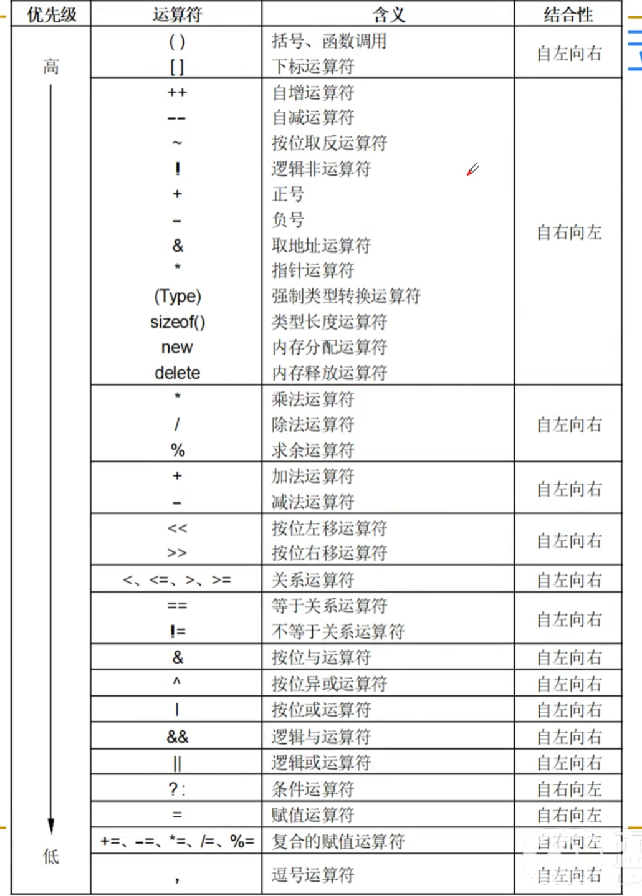

# 运算符与表达式语句

运算都是由 运算符和表达式来实现的.

## 表达式

<u> _**表达式是由运算符和操作数(变量、常量、函数调用等)组成的语句.**_</u>

> tips:
> 1.单个变量,单个常量是最简单的表达式.
> 2.确定值 `(a = b = 5;)`

---

## 运算符优先级

运算符的优先级决定了运算的顺序. 

## 基本运算符

### 算数运算符

`+，-，*，/` （加减乘除）

### 自增 自减 运算符

> 前置后置注意

### 赋值运算符

#### 符合的 =

`+= -= *= /= %=`

> 例如> a *= b  ----> a = a + b
#### 关系表达式

`==,!=, >, <, >=, <=`

#### 逻辑运算符

`&&, ||,!`

#### 条件运算符

`?:`

#### 位运算符

`&, |, ^, ~, <<, >>`

#### 其他运算符

`sizeof, typeof, ., ->`

