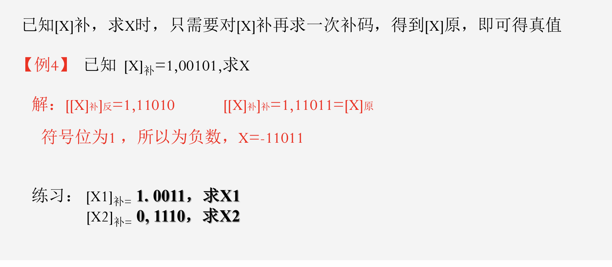

# 补码问题

## 计算机中的码制

### 1.原码：*最高位为符号位，其余位为数据数值的二进制值。如果真值是正数，则符号位为0，其他位保持不变； 如果真值是负数，则符号位为1，其他位保持不变。*

### 2.反码：`正数的反码与原码相同`；负数的反码在其原码的基础上，符号位不变，其他位按位求反。

### 3.补码：正数的补码与原码相同；负数的补码在其反码的基础上加1。

### 例题

例题1.


例题2.



## 补码的运算法则

```
[X1＋X2]补＝[X1]补＋[X2]补
[X1－X2]补＝[X1]补＋[－X2]补
```

### 注意：

1.运算时，符号位和数值位一样参加运算。如果符号位产生进位,则 `将进位“丢掉”`。

2.运算结果的符号位位0时，说明是正数的补码，其与原码相同。符号位为1时，说明是负数的补码

### 例题


